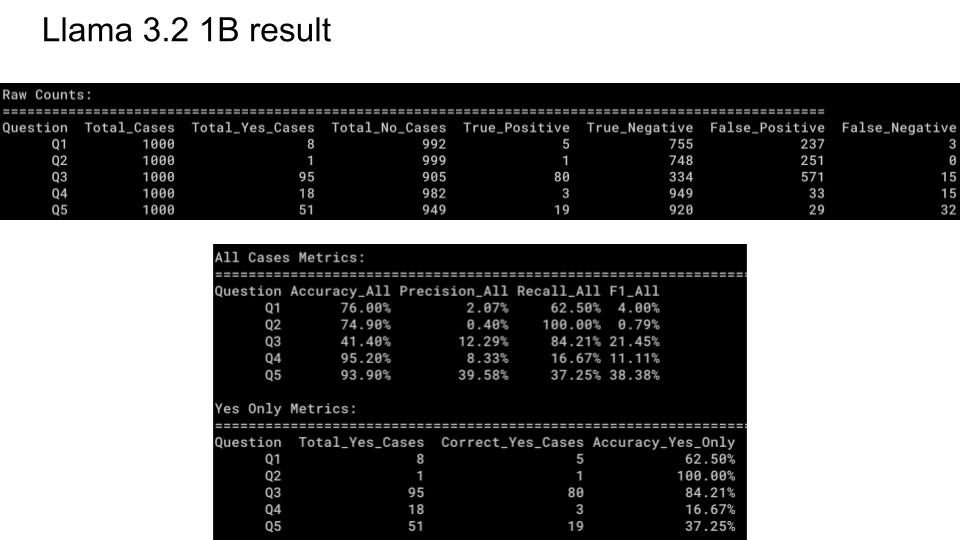
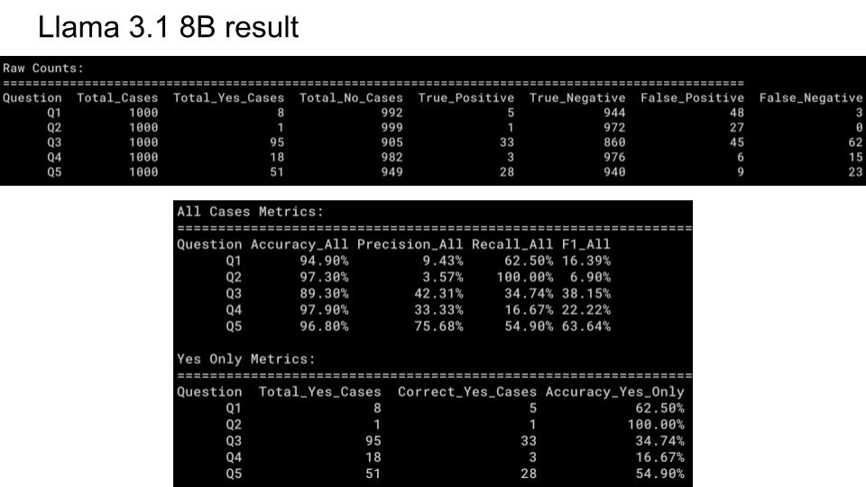
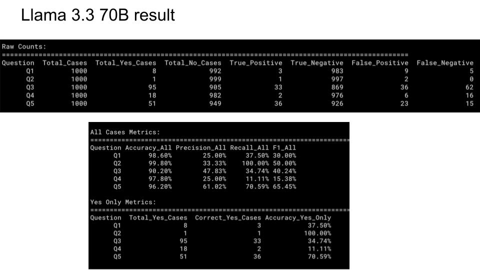
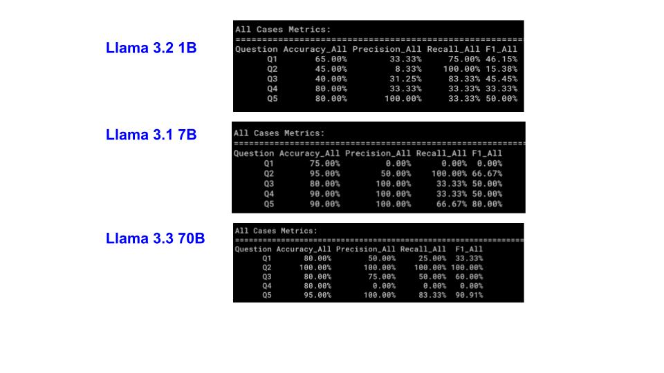
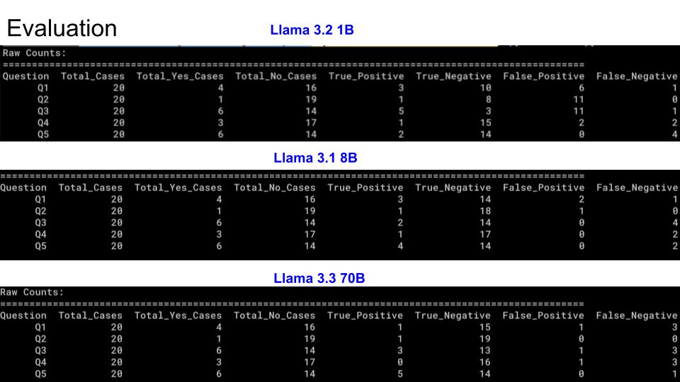

# Evaluation Analysis

## Overview
This analysis compares the performance of three LLaMA models (3.2 1B, 3.1 8B, and 3.3 70B) on a text analysis task focused on detecting concerning patterns in conversations.

## Processing Speed
* Speed performance measurements below were conducted without GPU acceleration.
### Frontend
* 5 samples take 15 minutes, so each job takes around 3 minutes to complete on MacBook Air (8G memory)
* Conversation size ranges from 8 lines to 20 lines
* Output format: Provides detailed evidence analysis in addition to Yes/No results

### CLI Tool
* 5 samples take 2 minutes and 4 seconds in MacBook Air (8G memory)
* Each sample takes 25 seconds
* Output format: Simple Yes/No response only

## Model Details
- LLaMA 3.2 1B: Smallest model (1 billion parameters)
- LLaMA 3.1 8B: Medium model (8 billion parameters)
- LLaMA 3.3 70B: Largest model (70 billion parameters)

## Evaluation Metrics
* The evaluation uses standard classification metrics:
- **True Positives (TP)**: Correctly predicted "yes"
- **True Negatives (TN)**: Correctly predicted "no"
- **False Positives (FP)**: Incorrectly predicted "yes"
- **False Negatives (FN)**: Incorrectly predicted "no"
- **Accuracy**: (TP + TN) / (TP + TN + FP + FN) = Correctly predicted / Total
- **Precision**: TP / (TP + FP) = True Positives / Total Predicted Positives
- **Recall**: TP / (TP + FN) = True Positives / Total Actual Positives
- **F1 Score**: 2 * (Precision * Recall) / (Precision + Recall)

## Large Dataset Results (1000 cases per question)
 * The data comes from Cornell Movie Dialogs
 * Claude AI 3.5 Sonnet was used to label the data as the "ground truth" (standard answer).
 * We compared three models: Llama 3.1 8B, 3.2 1B, and 3.3 70B against these labels.

### Results 

### Discussion
1. Important Data Pattern
   * Each question had 1000 total cases.
   * Most cases were labeled "No" (around 950-990 cases).
   * Very few cases were labeled "Yes" (only 1-95 cases).s
   * This imbalanced data affects how we should interpret the results.
2. Accuracy Analysis
   * The overall accuracy looks very high (90-99%) for all models
   * However, this high accuracy is misleading because:
     * A model could get high accuracy by simply answering "No" to everything.
     * This wouldn't mean it's actually good at identifying the important "Yes" cases.
3. Yes-Only Metrics
   * To better understand model performance, we looked at "Yes Only Metrics".
   * This shows how well models identify the rare but important "Yes" cases.
   * Surprisingly, all three models (3.1 8B, 3.2 1B, 3.3 70B) performed similarly on this metric.
4. Key Finding
   * The AI-generated labels (from Claude) might not perfectly match the true correct answers.
   * This led to manual verification of 20 cases to better understand the actual performance.

## Results Analysis - Small Dataset Results (20 cases per question)
* A smaller set of 20 cases was manually checked for more accurate evaluation. This gives us a clearer picture of true model performance.

### Results 

### Discussion

1. Llama 3.2 1B (smallest model):
   * Shows lower accuracy (40-80%).
   * Has high false positive rates, especially for Q2 (11 false positives). 
   * Performs best on Q4 and Q5 (80% accuracy).
2. Llama 3.1 8B (medium model):
   * Shows improved accuracy (75-95%).
   * Better precision with fewer false positives.
   * Shows strong performance on Q2-Q5 (90-95% accuracy).
3. Llama 3.3 70B (largest model):
   * Achieves highest accuracy (80-100%).
   * Shows excellent precision on Q2 and Q5 (100% precision).
   * Most balanced performance across metrics.
4. Key Insights from Manual Verification
   * The 20-case test reveals more realistic performance differences between models.
   * Larger models generally show better precision and fewer false positives. The performance gap between models is more apparent in this carefully verified dataset.

## Limitations
* AI-generated labels may not always match ground truth.
* Even with manual verification, smaller datasets (20 cases) may not fully represent model capabilities.
* Results suggest using larger models (3.3 70B) for more reliable results.

## Future work
* Improve Data Quality: Implement a hybrid labeling system combining human expert validation with AI labeling, followed by cross-validation to ensure accuracy and consistency.
